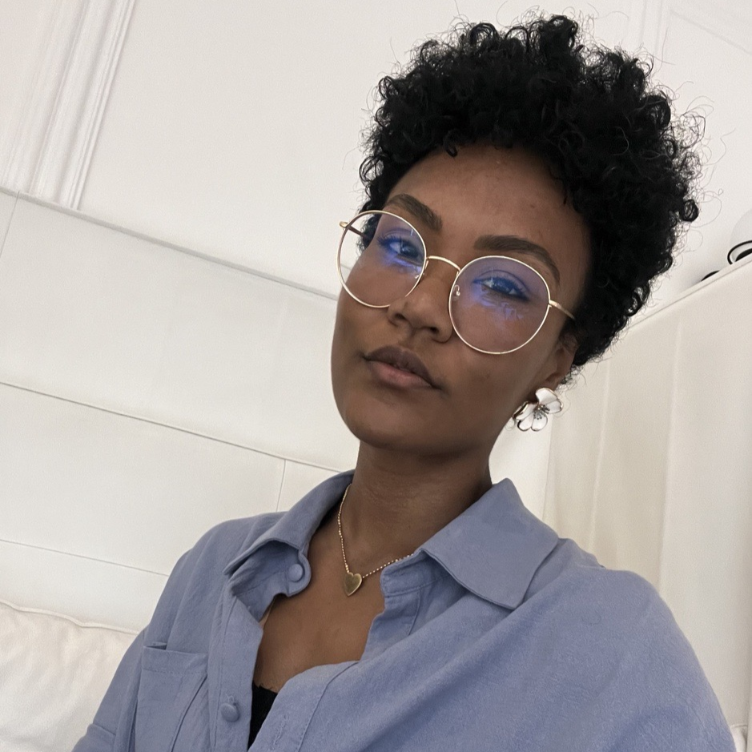
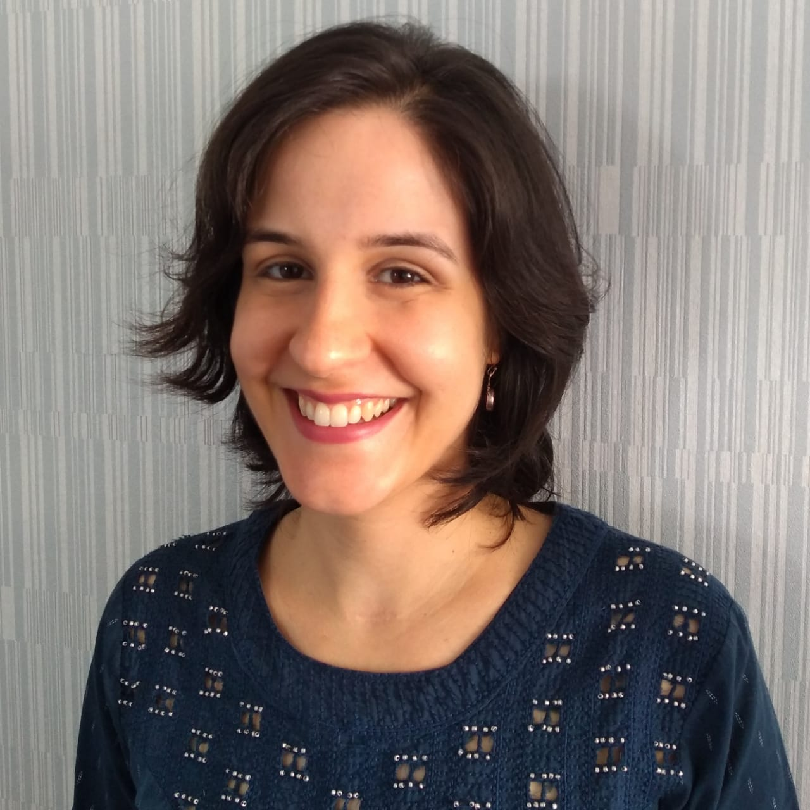
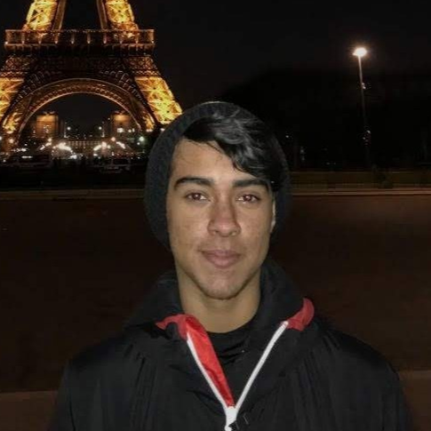

# Projeto Terraform
Organização criada para a elaboração do Trabalho Final do curso **Terraform - Zero to Hero**.
## Equipe 🙋‍♀️
### Integrantes:
- [Danielle Lopes](https://github.com/danilopeslima)
- [Danielle Pinheiro](https://github.com/DaniellePinheiro)
- [Marcia Escolastico](https://github.com/MEscola)
- [Paula Augusto](https://github.com/pcamposaugusto)
- [Gustavo Dantas](https://github.com/Gustavo-Dantas22)

  
  
  
  
  

## Objetivos👩‍💻 
- 
